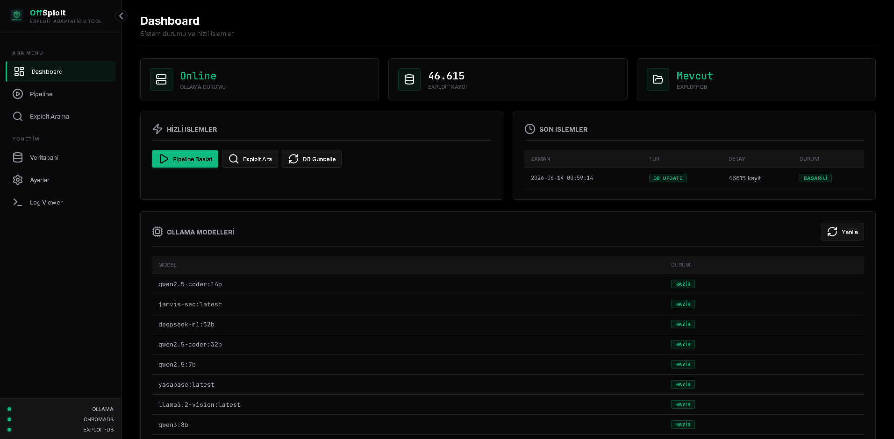
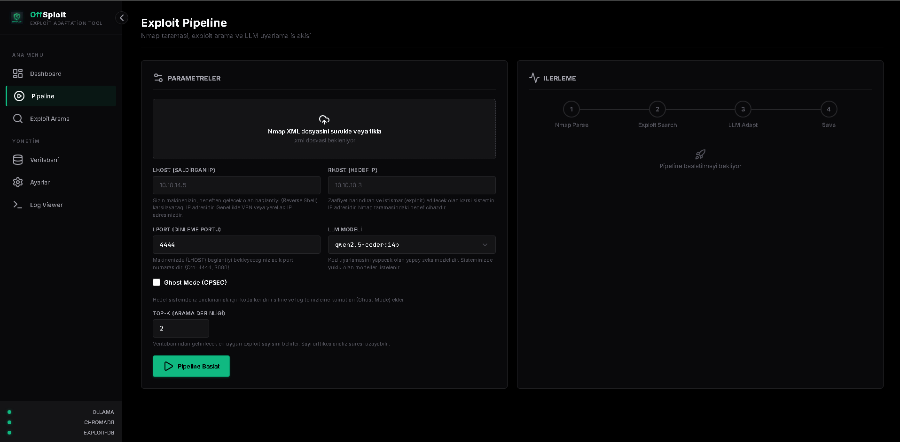
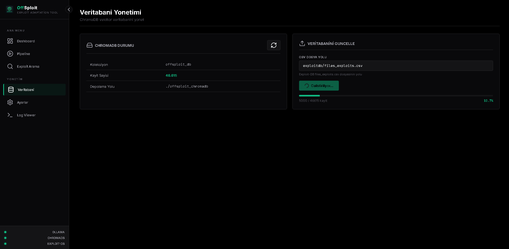
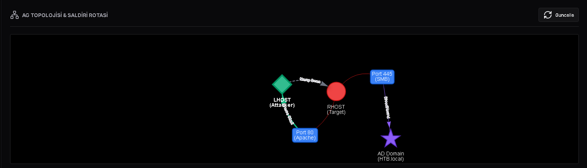

<div align="center">
  
</div>

# OffSploit: Autonomous Exploit Adaptation & C2 Framework

[](https://python.org)
[](LICENSE)
[](https://github.com/egnake/OffSploit/actions)



OffSploit is an advanced, autonomous Red Team and penetration testing framework designed to transcend traditional vulnerability scanning. It autonomously discovers vulnerabilities via Nmap/BloodHound inputs, leverages a **Retrieval-Augmented Generation (RAG)** engine to find relevant exploits, adapts the source code to the target environment using **Local LLMs**, and validates the execution through a **Self-Healing Docker Sandbox**.

Designed for high-security, air-gapped environments, OffSploit operates entirely offline, ensuring sensitive data never leaves your infrastructure.

---

## Core Architecture & Features

OffSploit is built upon a modular, event-driven pipeline encompassing several cutting-edge offensive security concepts:

### 1. Autonomous Exploit Adaptation (RAG + LLM)
Instead of relying on static, pre-compiled exploits, OffSploit dynamically reads Nmap XML outputs, semantically searches the Exploit-DB archive using a ChromaDB-backed RAG engine (`nomic-embed-text`), and utilizes local LLMs (e.g., `qwen2.5-coder`) to rewrite the exploit code, adjusting payloads, offsets, and execution parameters specifically for the target.

### 2. Multi-Agent OPSEC Swarm
OffSploit implements a multi-agent architectural pattern (`ExploitAgent` and `OPSECAgent`) operating in a circular feedback loop. Before any generated code is compiled, the `OPSECAgent` statically analyzes the AST to ensure Operational Security (OPSEC) compliance—flagging clear-text IP addresses, noisy process execution, or hardcoded signatures. If flagged, the code is returned for autonomous refactoring.

### 3. Self-Healing Docker Sandbox
Generated exploits are compiled within an isolated, network-restricted Docker container. If compilation or syntax errors occur (e.g., missing C headers, Python syntax issues), the stderr output is captured and fed back into the LLM. The system autonomously patches the code and recompiles it, repeating this self-healing loop until a functional binary/script is produced.

### 4. Polymorphic Evasion Engine (AV/EDR Bypass)
To bypass modern signature-based Antivirus (AV) and Endpoint Detection and Response (EDR) solutions, the Evasion Engine applies advanced polymorphic transformations to the adapted exploit code. Depending on the configured evasion level (`basic`, `advanced`, `paranoid`), it implements techniques such as:
*   **AST Restructuring:** Modifying the Abstract Syntax Tree structure without altering execution logic.
*   **Variable & Function Mangling:** Renaming all identifiers via deterministic, non-reversible seeds.
*   **String Obfuscation:** Encrypting known bad strings and payloads (e.g., XOR, Base64 with custom alphabets) which are decrypted only in memory at runtime.
*   **Indirect Syscalls & API Hashing:** For Windows targets, resolving Windows APIs via hashing and using indirect syscalls to bypass user-land API hooking often employed by EDRs.

### 5. Attack Path Correlator (Nmap + BloodHound)
OffSploit ingests both Nmap service data and BloodHound (Active Directory) JSON graphs. The correlator fuses these datasets to autonomously compute multi-stage attack paths. For instance, it can deduce a path starting with a service exploitation (Initial Access) leading to a compromised user node, followed by an AD privilege escalation vector (e.g., Pass-The-Hash to a Domain Admin).

### 6. State Machine & Autonomous Pivoting
Utilizing a NetworkX-based state machine, the framework tracks compromised assets as `PivotNodes`. Based on the current network topology and accumulated credentials, it calculates and recommends the next optimal strategic objective (e.g., Lateral Movement vs. Privilege Escalation).

### 7. Asynchronous Execution & Real-Time Tracking
The entire exploit pipeline runs asynchronously (`asyncio`) with a dedicated LLM Task Queue to prevent Out-Of-Memory (OOM) crashes on consumer hardware. Every execution step is logged locally via a thread-safe SQLite Session Database (`session_db`), and events are broadcasted in real-time to the web dashboard via Socket.IO, animating a dynamic `vis.js` network topology graph.

---

## Prerequisites & Installation

OffSploit relies heavily on local vector databases and AI inference engines.

### System Requirements
*   **Python:** 3.10 or higher.
*   **Docker Daemon:** Required for the Self-Healing Sandbox feature.
*   **Ollama:** Required for local LLM inference and embeddings.
*   **Nmap:** For target enumeration.

### Detailed Installation Steps (Beginner Friendly)

1. **Install Prerequisites (If you haven't already):**
   *   **Git:** Download and install from [git-scm.com](https://git-scm.com/downloads).
   *   **Docker:** Download and install Docker Desktop from [docker.com](https://www.docker.com/products/docker-desktop/). Make sure Docker is running before using the Sandbox feature.
   *   **Ollama:** Download from [ollama.com](https://ollama.com/download) and install. This is the engine that runs our local AI models.

2. **Clone the Repository:**
   Open your terminal (Command Prompt, PowerShell, or bash) and run:
   ```bash
   git clone https://github.com/egnake/OffSploit.git
   cd OffSploit
   ```

3. **Install Dependencies & CLI Tools:**
   We highly recommend using a virtual environment. The `pip install -e .` command installs OffSploit system-wide so you can run it from anywhere.
   ```bash
   # Install required python packages
   pip install -r requirements.txt
   
   # Install the OffSploit tool globally
   pip install -e .
   
   # Optional: Cloud LLM providers (Gemini / OpenAI)
   pip install -e ".[cloud]"
   ```

4. **Initialize Ollama Models:**
   Start the local AI models. We recommend `qwen2.5-coder` for optimal exploit generation capabilities.
   ```bash
   ollama run qwen2.5-coder:14b
   ollama run nomic-embed-text
   ```
   *(Note: The first time you run these, Ollama will download the models which may take a while depending on your internet speed).*

5. **Clone the Exploit-DB Archive:**
   The RAG engine requires the raw exploit source files to search through.
   ```bash
   git clone https://gitlab.com/exploit-database/exploitdb.git
   ```
   *Note: Ensure the folder is named `exploitdb` and resides in the root directory of the `OffSploit` project.*

---

## Configuration

Configuration is managed via `config.json`. Create your configuration file from the provided template:

```bash
cp config.json.example config.json
```

**Key Parameters:**
*   `use_docker_sandbox`: Boolean. Enables the isolated compilation environment.
*   `use_swarm`: Boolean. Activates the OPSEC validation feedback loop.
*   `evasion_level`: `basic`, `advanced`, or `paranoid`. Dictates the intensity of the polymorphic engine.
*   `top_k`: Integer. Number of similar exploits to retrieve from the RAG database per vulnerable service.

---

## Usage

OffSploit can be driven via its interactive Command Line Interface (CLI) or the real-time Web Dashboard.

### Web Dashboard (Recommended)





Launch the Flask-based dashboard using the installed CLI command:
```bash
offsploit-web
# or
python web/web_app.py
```
Navigate to `http://localhost:5000`. Through the UI, you can define LHOST/RHOST, upload Nmap XML and BloodHound JSON files, configure the evasion engine, and initiate the autonomous attack pipeline while monitoring real-time logs.

> [!WARNING]
> ### ChromaDB Status (Offline / Red)
> When you first launch the dashboard, the **ChromaDB** status in the bottom left will show as Offline (Red). This means the vector database hasn't been initialized.
> **To fix this:** Go to the **Veritabani (Database)** section from the sidebar, ensure your `files_exploits.csv` path is correct (default is `exploitdb/files_exploits.csv`), and click **Ingest Baslat**. This will parse the Exploit-DB CSV and create the vector database. Once completed, the status will turn Online (Green).

### Command Line Interface (CLI)

Because we installed the tool using `pip install -e .`, you can now open a terminal **anywhere** on your computer and simply type the following commands:

**Interactive Mode:**
```bash
offsploit -eng
```

**Standard Execution:**
```bash
offsploit --nmap scan.xml --lhost 10.10.14.5 --rhost 10.10.10.3 --obfuscate
```

### Docker Deployment
```bash
docker build -t offsploit .

# Run with host networking and mount Exploit-DB
docker run -it --rm --network host \
  -v $(pwd)/exploitdb:/opt/offsploit/exploitdb \
  offsploit --nmap scan.xml --lhost 10.10.14.5 --rhost 10.10.10.3
```

---

## Roadmap & Future Developments

The development of OffSploit is ongoing. The following features are planned for upcoming releases:
*   **Deep Active Directory Integration:** Incorporating advanced AD vectors beyond BloodHound mapping, such as automated Kerberos exploitation, Impacket integration, AS-REP Roasting, and Kerberoasting.
*   **OffSploit LLM Fine-Tuning:** Training and releasing a purpose-built, domain-specific AI model (`offsploit-coder`) specifically fine-tuned on offensive security concepts, exploit development, and OPSEC bypassing techniques to replace general-purpose coding models.
*   **Multi-Platform Support:** Expanding the Docker Sandbox compilation mechanisms to autonomously cross-compile exploits for esoteric architectures (MIPS, ARM) alongside standard x86/x64 binaries.

---

## Contributing

We welcome contributions from the security research community. Please refer to [CONTRIBUTING.md](CONTRIBUTING.md) for architectural guidelines, coding standards, and information on implementing new Evasion transforms or LLM providers.

---

## Disclaimer & Legal Notice

OffSploit is developed strictly for **authorized penetration testing, Red Team operations, and educational purposes**. The use of this tool against systems without explicit, prior consent is illegal and strictly prohibited. The developer(s) assume no liability and are not responsible for any misuse or damage caused by this framework.

---
## TR
---

<div align="center">
  
</div>

# OffSploit: Otonom Exploit Uyarlama & C2 Framework'ü


OffSploit, geleneksel zafiyet tarama araçlarının ötesine geçmek üzere tasarlanmış gelişmiş, otonom bir Red Team ve sızma testi çerçevesidir. Nmap/BloodHound girdileri aracılığıyla zafiyetleri otonom olarak keşfeder, **Retrieval-Augmented Generation (RAG)** motorundan yararlanarak ilgili istismar (exploit) kodlarını bulur, **Yerel LLM'ler** kullanarak bu kodları hedef ortama uyarlar ve yürütme doğruluğunu **Kendi Kendini Onaran (Self-Healing) Docker Sandbox** içerisinde test eder.

Yüksek güvenlikli ve internete tamamen kapalı (air-gapped) yalıtılmış ağlar için tasarlanan OffSploit, bütünüyle çevrimdışı çalışarak hassas operasyonel verilerinizin altyapınızı asla terk etmemesini garanti altına alır.

---

## Çekirdek Mimari ve Özellikler

OffSploit, birçok yenilikçi ofansif güvenlik konseptini barındıran modüler ve olay güdümlü (event-driven) bir boru hattı (pipeline) üzerine inşa edilmiştir:

### 1. Otonom Exploit Uyarlaması (RAG + LLM)
OffSploit, statik ve önceden derlenmiş istismar kodlarına güvenmek yerine, Nmap XML çıktılarını dinamik olarak okur, ChromaDB destekli bir RAG motoru (`nomic-embed-text`) kullanarak Exploit-DB arşivini anlamsal (semantik) olarak tarar ve yerel LLM'leri (örn. `qwen2.5-coder`) kullanarak kaynak kodunu yeniden yazar. Bu süreçte payload'ları, bellek ofsetlerini ve yürütme parametrelerini doğrudan hedefe göre ayarlar.

### 2. Multi-Agent OPSEC Swarm
OffSploit, döngüsel bir geri bildirim döngüsünde çalışan çoklu-ajan (`ExploitAgent` ve `OPSECAgent`) mimari kalıbını uygular. Üretilen herhangi bir kod derlenmeden önce, `OPSECAgent` Kodu AST (Abstract Syntax Tree) seviyesinde statik olarak analiz eder ve Operasyonel Güvenlik (OPSEC) standartlarına uygunluğunu denetler (Açık metin IP adresleri, gürültülü process çağrıları veya gömülü imzalar var mı?). Eğer riskli bulunursa, kod otonom refactoring için reddedilir.

### 3. Kendi Kendini Onaran (Self-Healing) Docker Sandbox
Üretilen istismar kodları, ağ izolasyonlu bir Docker container'ı içerisinde derlenir. Eğer derleme veya sözdizimi hataları oluşursa (örn. eksik C header dosyaları veya Python syntax hataları), standart hata çıktısı (stderr) yakalanır ve LLM'e geri beslenir. Sistem, çalışan bir ikili dosya (binary) veya betik (script) üretilene kadar kodu otonom olarak yamalar, yeniden derler ve bu döngüyü sürdürür.

### 4. Polimorfik Evasion Engine (AV/EDR Atlatma)
Modern imza tabanlı Antivirüs (AV) ve Uç Nokta Tehdit Algılama (EDR) çözümlerini atlatmak için Evasion Motoru, uyarlanan exploit koduna gelişmiş polimorfik dönüşümler uygular. Yapılandırılan kaçınma (evasion) seviyesine (`basic`, `advanced`, `paranoid`) bağlı olarak aşağıdaki teknikleri uygular:
*   **AST Yeniden Yapılandırma:** Yürütme mantığını değiştirmeden kodun Abstract Syntax Tree (Soyut Sözdizimi Ağacı) yapısını değiştirir.
*   **Değişken ve Fonksiyon Gizleme:** Koddaki tüm tanımlayıcıları (identifier) deterministik tohumlar (seed) kullanarak tamamen anlamsız isimlerle değiştirir.
*   **String Obfuscation:** Kötü niyetli olduğu bilinen stringleri ve payload'ları (XOR, özel alfabeli Base64 vb. ile) şifreler, bunlar yalnızca çalışma zamanında (runtime) bellekte çözülür.
*   **Dolaylı Sistem Çağrıları (Indirect Syscalls):** Windows hedefleri için, Windows API'lerini hash yöntemleriyle çözer ve EDR'lar tarafından sıklıkla kullanılan user-land (kullanıcı alanı) API kancalamalarını (hooking) atlatmak için dolaylı sistem çağrılarını kullanır.

### 5. Saldırı Yolu Korelatörü (Nmap + BloodHound)
OffSploit, hem Nmap servis verilerini hem de BloodHound (Active Directory) JSON grafiklerini içe aktarır. Korelatör, çok aşamalı saldırı yollarını otonom olarak hesaplamak için bu veri setlerini birleştirir. Örneğin, servis sömürüsüyle (Initial Access) başlayan ve ele geçirilmiş bir kullanıcı düğümüne ulaşan, ardından bir AD yetki yükseltme vektörüne (örn. Domain Admin'e yönelik Pass-The-Hash) uzanan zincirleme bir rota çıkarabilir.

### 6. State Machine & Otonom Pivoting
NetworkX tabanlı bir durum makinesi (state machine) kullanarak, çerçeve ele geçirilen varlıkları `PivotNodes` olarak izler. Mevcut ağ topolojisi ve toplanan kimlik bilgilerine dayanarak, bir sonraki optimal stratejik hedefi (örn. Yanal Hareket'e karşı Yetki Yükseltme) otonom olarak hesaplar ve önerir.

### 7. Asenkron Mimari ve Gerçek Zamanlı İzleme
Tüm exploit boru hattı asenkron (`asyncio`) çalışır ve kısıtlı donanımlarda VRAM taşmalarını (OOM) önlemek için LLM isteklerini özel bir kuyrukta (Queue) sıralı işler. İşlemin her aşaması SQLite tabanlı bir Oturum Veritabanına (`session_db`) kaydedilirken, olaylar anlık olarak Web arayüzüne Socket.IO ile iletilerek `vis.js` destekli dinamik ağ topolojisi üzerinde görselleştirilir.

---

## Önkoşullar ve Kurulum

OffSploit yerel vektör veritabanlarına ve yapay zeka çıkarım motorlarına yüksek oranda bağımlıdır.

### Sistem Gereksinimleri
*   **Python:** 3.10 veya üzeri.
*   **Docker Daemon:** Self-Healing Sandbox özelliği için gereklidir.
*   **Ollama:** Yerel LLM çıkarımı ve embedding'ler için gereklidir.
*   **Nmap:** Hedef ağ keşfi için.

### Detaylı Kurulum Adımları (Yeni Başlayanlar İçin)

1. **Önkoşulları Yükleyin (Eğer yüklü değilse):**
   *   **Git:** Kaynak kodları indirmek için [git-scm.com](https://git-scm.com/downloads) adresinden indirip kurun.
   *   **Docker:** Sandbox özelliği için [docker.com](https://www.docker.com/products/docker-desktop/) adresinden Docker Desktop indirip kurun. Kullanmadan önce Docker'ın arka planda çalıştığından emin olun.
   *   **Ollama:** Yerel yapay zeka modellerimizi çalıştırmak için [ollama.com](https://ollama.com/download) adresinden indirip kurun.

2. **Repoyu Klonlayın:**
   Terminalinizi (CMD, PowerShell veya bash) açın ve şu komutları girin:
   ```bash
   git clone https://github.com/egnake/OffSploit.git
   cd OffSploit
   ```

3. **Bağımlılıkları ve CLI Araçlarını Yükleyin:**
   Sanal ortam (virtual environment) kullanmanız önerilir. Aşağıdaki `pip install -e .` komutu, OffSploit'i sisteminize küresel olarak kurar, böylece terminalde her yerden çağırabilirsiniz.
   ```bash
   # Gerekli python paketlerini kurun
   pip install -r requirements.txt
   
   # OffSploit aracını sisteme kurun
   pip install -e .
   
   # Opsiyonel: Bulut LLM sağlayıcıları (Gemini / OpenAI)
   pip install -e ".[cloud]"
   ```

4. **Ollama Modellerini Başlatın:**
   Optimum exploit üretimi için yerel yapay zeka modellerini indirelim.
   ```bash
   ollama run qwen2.5-coder:14b
   ollama run nomic-embed-text
   ```
   *(Not: Bu komutları ilk çalıştırdığınızda Ollama modelleri indirecektir. İnternet hızınıza bağlı olarak bu işlem biraz zaman alabilir).*

5. **Exploit-DB Arşivini Klonlayın:**
   RAG motorunun zafiyet arayabilmesi için ham istismar kodlarına ihtiyacı vardır.
   ```bash
   git clone https://gitlab.com/exploit-database/exploitdb.git
   ```
   *Not: Klasörün adının `exploitdb` olduğundan ve `OffSploit` projesinin kök dizininde bulunduğundan emin olun.*

---

## Yapılandırma

Yapılandırma `config.json` dosyası üzerinden yönetilir. Sağlanan şablondan kendi konfigürasyon dosyanızı oluşturun:

```bash
cp config.json.example config.json
```

**Temel Parametreler:**
*   `use_docker_sandbox`: Boolean. İzole derleme ortamını etkinleştirir.
*   `use_swarm`: Boolean. OPSEC doğrulama geri bildirim döngüsünü aktifleştirir.
*   `evasion_level`: `basic`, `advanced` veya `paranoid`. Polimorfik motorun yoğunluğunu belirler.
*   `top_k`: Integer. Zafiyetli her servis başına RAG veritabanından çekilecek benzer exploit sayısı.

---

## Kullanım

OffSploit, interaktif Komut Satırı Arayüzü (CLI) veya gerçek zamanlı Web Dashboard üzerinden yönetilebilir.

### Web Dashboard (Önerilen)


Yüklenen CLI komutuyla Flask tabanlı paneli başlatın:
```bash
offsploit-web
# veya
python web/web_app.py
```
Tarayıcınızdan `http://localhost:5000` adresine gidin. Arayüz üzerinden LHOST/RHOST tanımlayabilir, Nmap XML ve BloodHound JSON dosyalarını yükleyebilir, Evasion motorunu yapılandırabilir ve gerçek zamanlı logları izleyerek otonom saldırı boru hattını başlatabilirsiniz.

> [!WARNING]
> ### ChromaDB Durumu (Offline / Kırmızı)
> Paneli ilk başlattığınızda sol alt kısımdaki **ChromaDB** durumu Offline (Kırmızı) olarak görünecektir. Bu, vektör veritabanının henüz oluşturulmadığını gösterir.
> **Çözümü:** Sol menüden **Veritabanı (Database)** sekmesine gidin. `files_exploits.csv` yolunun doğruluğundan emin olun (varsayılan: `exploitdb/files_exploits.csv`) ve **Ingest Başlat** butonuna tıklayın. Bu işlem Exploit-DB CSV dosyasını okuyup ChromaDB vektör veritabanını oluşturacaktır. Tamamlandığında durum Online (Yeşil) olacaktır.

### Komut Satırı Arayüzü (CLI)

Aracı `pip install -e .` komutu ile sisteme kurduğumuz için, artık bilgisayarınızın **herhangi bir yerinde** terminal açıp aşağıdaki komutları direkt yazabilirsiniz:

**İnteraktif Mod:**
```bash
offsploit
```

**Standart Yürütme:**
```bash
offsploit --nmap scan.xml --lhost 10.10.14.5 --rhost 10.10.10.3 --obfuscate
```

### Docker ile Dağıtım
```bash
docker build -t offsploit .

# Host network modunda çalıştırın ve Exploit-DB'yi bağlayın
docker run -it --rm --network host \
  -v $(pwd)/exploitdb:/opt/offsploit/exploitdb \
  offsploit --nmap scan.xml --lhost 10.10.14.5 --rhost 10.10.10.3
```

---

## Gelecek Planları ve Yol Haritası (Roadmap)

OffSploit'in gelişimi hız kesmeden devam etmektedir. Gelecek sürümler için planlanan bazı temel özellikler şunlardır:
*   **Derin Active Directory Entegrasyonu:** Yalnızca BloodHound haritalamasıyla sınırlı kalmayıp; otomatik Kerberos istismarları (AS-REP Roasting, Kerberoasting), Impacket modüllerinin otonom kullanımı ve AD yetki yükseltme vektörlerinin RAG motoruna dahil edilmesi.
*   **OffSploit LLM Fine-Tuning:** Sadece ofansif güvenlik, exploit geliştirme ve OPSEC atlatma teknikleri üzerine özel olarak eğitilmiş, genel amaçlı kodlama modellerinin (qwen/llama) yerini alacak `offsploit-coder` adlı amaca yönelik (domain-specific) bir yapay zeka modelinin geliştirilmesi ve yayınlanması.
*   **Çoklu Platform Desteği:** Docker Sandbox derleme mekanizmalarını genişleterek, standart x86/x64 hedeflerinin yanı sıra otonom olarak MIPS, ARM gibi mimariler için cross-compile exploit üretebilme yeteneği.

---

## Katkıda Bulunma

Güvenlik araştırması topluluğundan gelen katkıları memnuniyetle karşılıyoruz. Mimari kurallar, kodlama standartları ve yeni Evasion modülleri veya LLM sağlayıcıları uygulamakla ilgili bilgiler için lütfen [CONTRIBUTING.md](CONTRIBUTING.md) dosyasını inceleyin.

---

## Yasal Uyarı ve Sorumluluk Reddi

OffSploit kesinlikle ve sadece **yetkili sızma testleri, Red Team operasyonları ve eğitim amaçlı** geliştirilmiştir. Bu aracın açık ve önceden alınmış bir izin olmaksızın sistemlere karşı kullanılması yasa dışıdır ve kesinlikle yasaktır. Geliştirici(ler) hiçbir sorumluluk kabul etmez ve bu çerçevenin neden olabileceği herhangi bir kötüye kullanım veya hasardan sorumlu tutulamaz.
